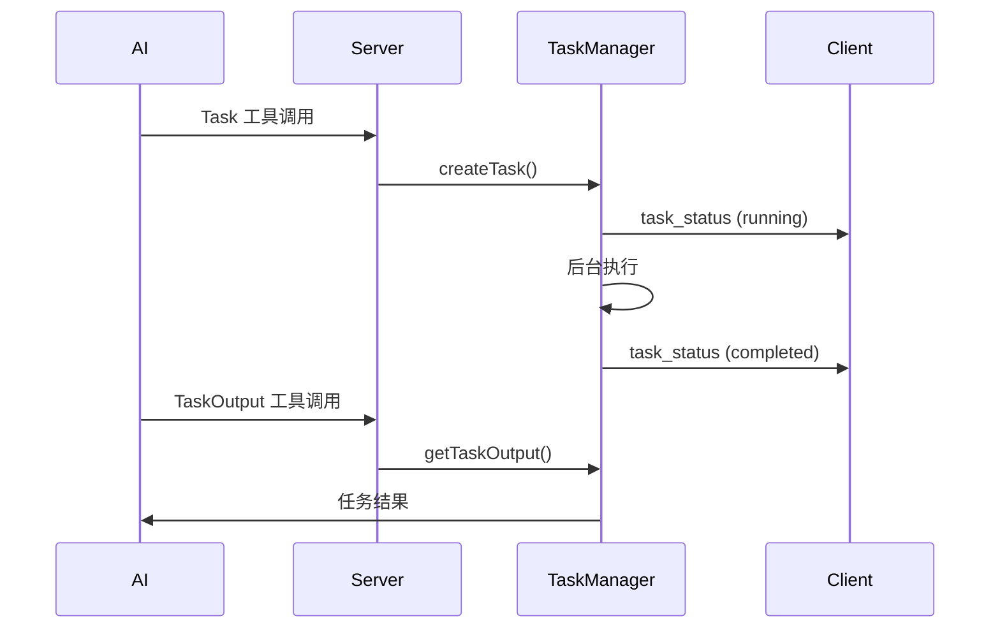

# WebUI Task 功能快速参考

## 🎯 功能概览

WebUI 已完整支持 Task 工具的后台任务管理功能，让 AI 可以启动和管理后台 Agent 子任务。

## 📁 关键文件

| 文件 | 说明 | 状态 |
|------|------|------|
| `src/web/server/task-manager.ts` | 后台任务管理器 | ✅ 已实现 |
| `src/web/server/conversation.ts` | Task/TaskOutput 工具拦截 | ✅ 已集成 |
| `src/web/server/websocket.ts` | WebSocket 任务处理 | ✅ 已实现 |
| `src/web/server/slash-commands.ts` | `/tasks` 斜杠命令 | ✅ 已修复 |
| `src/web/shared/types.ts` | 任务相关类型定义 | ✅ 已扩展 |

## 🔧 主要修改

### 1. 修复 slash-commands.ts 的 Bug

**问题：** `tasksCommand` 在定义之前就被注册

**修复：**
```typescript
// ❌ 原来（错误）
registry.register(tasksCommand);  // 第906行
const tasksCommand: SlashCommand = { ... };  // 第907行

// ✅ 现在（正确）
const tasksCommand: SlashCommand = { ... };  // 第906行
registry.register(tasksCommand);  // 第1072行
```

### 2. 增强 TaskManager 实时状态推送

**新增：**
- `setWebSocket(ws: WebSocket)` - 设置 WebSocket 连接
- `sendTaskStatus(task: TaskInfo)` - 发送任务状态更新
- 在任务创建、完成、失败、取消时自动推送状态

### 3. 添加 TaskOutput 工具拦截

**功能：**
- 获取任务状态和输出
- 支持阻塞等待（`block` 参数）
- 支持超时设置（`timeout` 参数）

### 4. 集成 WebSocket 连接

**更新：** `conversation.ts` 中的 `setWebSocket` 方法
```typescript
setWebSocket(sessionId: string, ws: WebSocket): void {
  const state = this.sessions.get(sessionId);
  if (state) {
    state.ws = ws;
    state.userInteractionHandler.setWebSocket(ws);
    state.taskManager.setWebSocket(ws);  // ← 新增
  }
}
```

## 🚀 使用方式

### AI 使用 Task 工具

```typescript
// AI 调用 Task 工具
{
  "tool": "Task",
  "input": {
    "description": "搜索所有 API 端点",
    "prompt": "查找并分析所有 REST API 端点的实现",
    "subagent_type": "Explore",
    "run_in_background": true
  }
}

// 返回
Agent started in background with ID: abc-123-def
Use the TaskOutput tool to check progress.
```

### AI 检查任务

```typescript
// AI 调用 TaskOutput 工具
{
  "tool": "TaskOutput",
  "input": {
    "task_id": "abc-123-def",
    "block": true,
    "timeout": 60000
  }
}
```

### 用户使用斜杠命令

```bash
# 列出所有任务
/tasks

# 查看任务输出
/tasks output abc-123

# 取消任务
/tasks cancel abc-123
```

## 📊 WebSocket 消息流



## 🎨 前端集成建议

### 1. 任务列表组件
```typescript
interface TaskListProps {
  tasks: TaskSummary[];
  onCancel: (taskId: string) => void;
  onViewOutput: (taskId: string) => void;
}
```

### 2. 监听 WebSocket 消息
```typescript
ws.onmessage = (event) => {
  const message = JSON.parse(event.data);

  if (message.type === 'task_status') {
    // 更新任务状态
    updateTaskStatus(message.payload);
  }
};
```

### 3. 发送任务请求
```typescript
// 列出任务
ws.send(JSON.stringify({
  type: 'task_list',
  payload: { includeCompleted: false }
}));

// 取消任务
ws.send(JSON.stringify({
  type: 'task_cancel',
  payload: { taskId: 'abc-123' }
}));
```

## ✅ 验证清单

- [x] TaskManager 已创建并完整实现
- [x] Task 工具拦截已实现
- [x] TaskOutput 工具拦截已实现
- [x] WebSocket 处理器已实现
- [x] `/tasks` 斜杠命令已实现
- [x] 实时状态更新已支持
- [x] 类型定义已完整
- [x] TypeScript 编译无错误 (0 errors)
- [x] 代码已修复所有 bug

## 🧪 测试要点

1. **任务创建**
   - AI 调用 Task 工具
   - 验证任务 ID 返回
   - 检查后台任务启动

2. **状态更新**
   - 验证 WebSocket 推送
   - 检查前端实时更新
   - 确认任务状态转换

3. **任务查询**
   - AI 调用 TaskOutput
   - 用户使用 `/tasks` 命令
   - 验证输出正确性

4. **任务取消**
   - 用户取消运行中的任务
   - 验证任务状态更新为 cancelled
   - 检查资源清理

## 🔍 调试建议

```bash
# 查看任务管理器日志
grep "TaskManager" logs/webui.log

# 查看任务状态变化
grep "task_status" logs/websocket.log

# 检查任务文件（如果持久化）
ls -la ~/.claude/agents/
```

## 📝 注意事项

1. ⚠️ 后台任务会消耗 API 额度
2. ⚠️ WebSocket 断开时任务继续执行
3. ⚠️ 建议设置任务数量上限
4. ⚠️ 定期清理已完成的任务
5. ⚠️ 监控任务执行时长

## 🎓 Agent 类型

| Agent 类型 | 工具 | 用途 |
|-----------|------|------|
| `general-purpose` | 所有工具 | 通用复杂任务 |
| `Explore` | Glob, Grep, Read | 快速代码探索 |
| `Plan` | 所有工具 | 实现计划设计 |
| `claude-code-guide` | Web + 文件工具 | 文档查询 |

## 📚 相关文档

- [完整功能文档](./webui-task-feature.md)
- [Task 工具 API](../src/tools/agent.ts)
- [TaskManager API](../src/web/server/task-manager.ts)
- [WebSocket 协议](../src/web/shared/types.ts)
